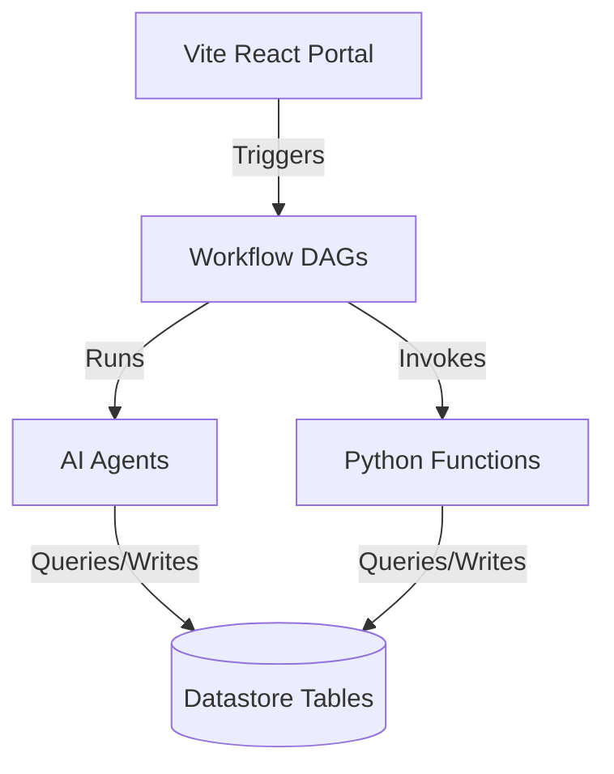

# Architecture Document

OpenSource Mentor follows Clean Architecture, SOLID design principles, and Domain-Driven Design (DDD).

## Core Architecture Layers
1. **Domain (Tables)**: Persisted database tables defining the boundaries of our workspace: users, repositories, issues, tasks, modules, pull requests, reviews, and knowledge records.
2. **Use Cases (Workflows)**: Directed Acyclic Graphs (DAGs) representing core business operations like `import-repository`, `recommend-issues`, and `review-pull-request`.
3. **Services (Functions)**: Stateless serverless Python endpoints that integrate with external APIs (e.g., GitHub REST API) and handle transactions.
4. **Interfaces (Agents)**: Autonomously reasoning LLM agents that read code, write knowledge explanations, score tickets, and draft PR reviews.

For detail-level listings of layout structures, refer to [PROJECT_STRUCTURE.md](./PROJECT_STRUCTURE.md).
