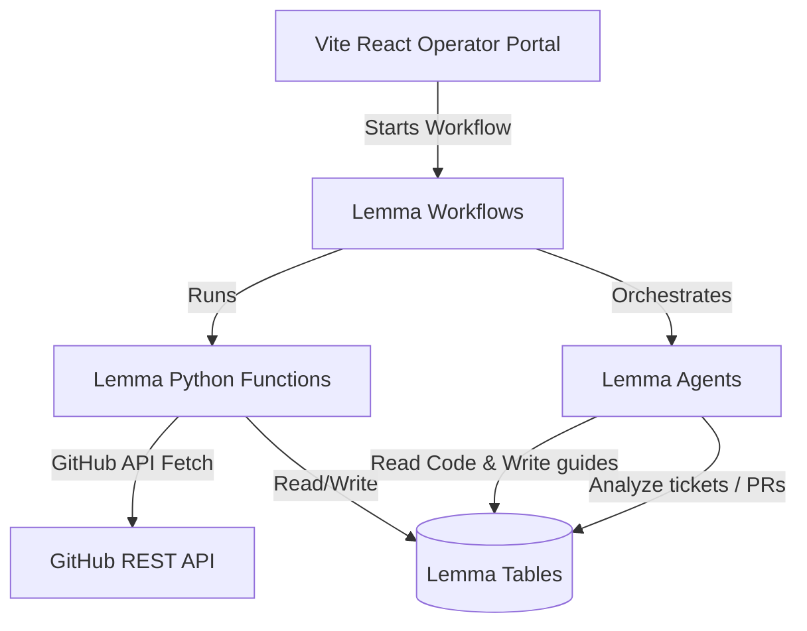

# Hackathon Submission — OpenSource Mentor

**OpenSource Mentor** is an AI-native Open Source Contribution Workspace built on top of the **Lemma Platform**.

---

## 1. Project Summary
OpenSource Mentor transforms how developers discover, understand, and contribute to open-source software. By combining structured relational datastores (Lemma Tables), stateless serverless execution (Lemma Functions), autonomous reasoning agents (Lemma Agents), and a human-in-the-loop workflow coordinator (Lemma Workflows), OpenSource Mentor provides a personalized SaaS dashboard where developers can onboard any codebase, understand its architecture, find beginner-friendly tasks, study customized learning paths, and receive automated PR review feedback.

---

## 2. Problem Statement
Contributing to open source has a notoriously high barrier to entry:
- **Architecture Complexity**: New developers face massive, undocumented codebases with no clear entry points.
- **Ticket Overwhelm**: Finding a "good first issue" that matches a developer's specific skill level is tedious.
- **Guidance Deficit**: Maintainers are busy, leaving contributors stuck on setup issues, prerequisites, or failing checks.
- **Review Delay**: PR feedback is slow, discouraging contributors and blocking progress.

---

## 3. The Solution
OpenSource Mentor acts as a 24/7 dedicated mentor that resides directly inside the developer's workspace.
1. **Understand**: Explains codebase layout and draws Mermaid dependency flow charts.
2. **Recommend**: Scores issues based on difficulty, estimating time requirements for beginner-friendly tasks.
3. **Teach**: Generates a modular learning curriculum tailored to the specific code modules touched by the claimed ticket.
4. **Review**: Offers immediate AI-driven pull request code reviews and suggestions.

---

## 4. Architecture Overview

- **Database Layer (Tables)**: Persists schemas for `users`, `repositories`, `issues`, `tasks`, `learning_modules`, `pull_requests`, `reviews`, and `knowledge` (which stores the vector and text architecture representations).
- **Service Layer (Functions)**: Stateless serverless Python endpoints running inside AgentBox, fetching and writing GitHub data.
- **Intelligence Layer (Agents)**: A cooperative network of 6 specialized agents:
  - `repository-analyzer` & `architecture-explainer` (Onboarding & UML generation)
  - `issue-recommender` (Ticket categorization & scoring)
  - `learning-coach` (Curriculum compilation)
  - `contribution-tracker` (Weekly telemetry & summary reports)
  - `pr-review-assistant` (Pull request feedback & diff suggestions)
- **Coordination Layer (Workflows)**: Five human-in-the-loop workflows linking forms, functions, and agents.

---

## 5. Lemma Integration Highlights

OpenSource Mentor showcases the core capabilities of the Lemma Platform:
- **Persistent Context**: Uses Lemma Tables instead of stateless chat histories. This ensures agents can query previous state (such as the developer's skill level or claimed tickets) to generate context-aware answers.
- **Hybrid Code-LLM execution**: Uses stateless Python functions for structured API integrations (fetching GitHub repos/issues) and switches to LLM agents for cognitive tasks (reasoning on code structure, scoring ticket complexity).
- **Human-in-the-Loop workflows**: Uses workflow nodes (e.g. `FORM`, `DECISION`) to coordinate actions, letting the developer control progress (e.g. claiming a ticket triggers a downstream agent autonomously).

---

## 6. Technical Highlights

- **Dynamic UML Generation**: The `architecture-explainer` generates valid Mermaid.js diagrams on the fly, which are rendered visually in the React frontend.
- **TypeScript Core Typing**: Clean frontend integration with `lemma-sdk` using index signatures and type assertions.
- **Pydantic Validation**: All functions compile and run with strict inputs/outputs validation via Pydantic.

---

## 7. Known Limitations & Future Roadmap

### Limitations
- **API Rate Limits**: Hits GitHub rate limit easily without a configured `GITHUB_API_TOKEN`.
- **Large Repositories**: Processing repositories with millions of lines of code requires chunked vector indexing rather than direct folder scanning.

### Roadmap
- **IDE Extensions**: Bring OpenSource Mentor directly into VS Code and JetBrains as a sidebar tool.
- **Interactive Checkpoints**: Provide interactive terminals where users can complete checkpoint challenges and have their code checked by the agent in real time.

---

## 8. Presentation & Demo Script (5–10 Minutes)

### Phase 1: Intro (1 min)
- Introduce the mission of OpenSource Mentor: To make open-source onboarding delightful and AI-guided.
- Show the clean Operator Dashboard page.

### Phase 2: Onboarding django/django (2 mins)
- Navigate to the **Repositories** tab.
- Paste a URL and click **Import**.
- Explain that the `import-repository` workflow is running asynchronously: it uses a Python function to validate and fetch code, then invokes the `repository-analyzer` and `architecture-explainer` agents.
- Click the repository details: Show the generated package diagram and dependency flowchart (Mermaid render).

### Phase 3: Getting a Ticket (2 mins)
- Open the **Issues** tab. Show the difficulty scores (e.g., "Fix template caching - Difficulty: 25 - Good First Issue").
- Click **Claim Ticket**. Explain that this writes to the datastore, which triggers the `learning-coach` agent.
- Navigate to the **Learning Center** and show the custom onboarding path generated for this specific caching ticket.

### Phase 4: Reviewing code (2 mins)
- Show the **PR Review** tab. Explain that a developer pushed a draft PR to solve the caching issue.
- Click **Run AI Review**. Show the generated code diff suggestions, demonstrating the agent's ability to read and provide structured refactoring recommendations.
- Show the **Weekly Progress** report.

---

## 9. Judge Talking Points

- **Why use Lemma?**
  * "Lemma allows us to build cooperative AI systems. Instead of a single chatbot that forgets context, Lemma allows us to structure data in persistent tables, execute arbitrary code in serverless python functions, and link multiple agents in a stateful workflow."
- **How do you prevent Mermaid rendering issues?**
  * "Our `architecture-explainer` agent is explicitly instructed to format diagrams using strict Mermaid syntax constraints, which are parsed safely by the React UI."
- **Is this safe to run?**
  * "Yes. Python functions run in isolated AgentBox sandboxes, and permissions are governed by role-based grants defined explicitly in `pod.json`."
